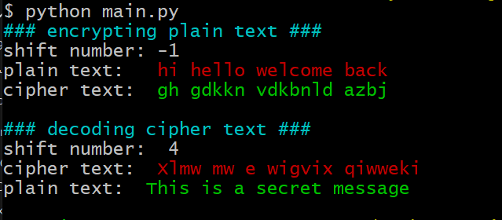

# Caeser Cipher Python
This is implementation of Caesar cipher in Python 3 which shifts characters and letters by specific number positive or negative

##### Here is sample output for this script:

